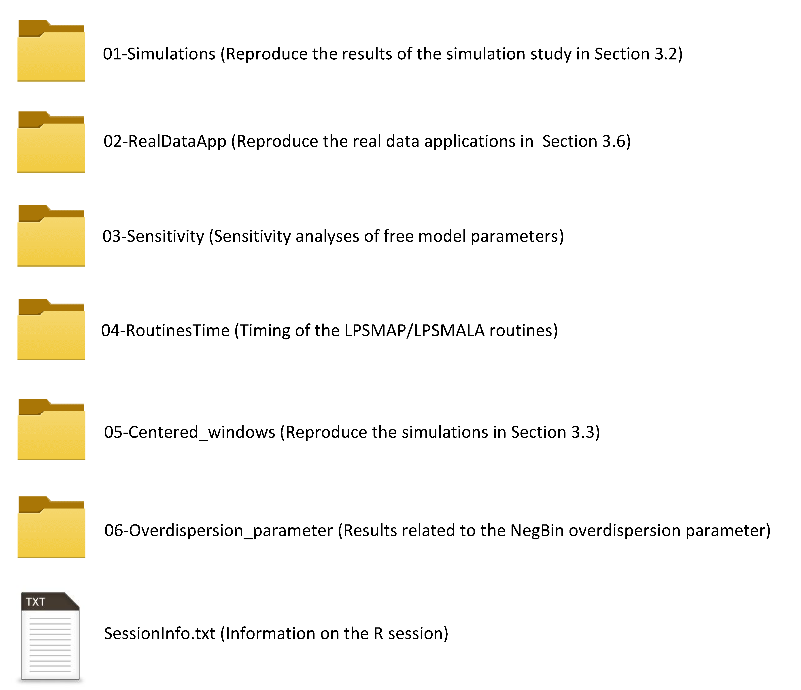

Reproducing the results of the EpiLPS article
================
Oswaldo Gressani
2022-05-25

### Structure of the repository

Contains the routines to reproduce the results of the EpiLPS paper based
on the CRAN package <https://cran.r-project.org/package=EpiLPS> version
1.0.5.

### Acknowledgments

This project is funded by the European Union’s Research and Innovation
Action under the H2020 work programme, EpiPose (grant number 101003688).
